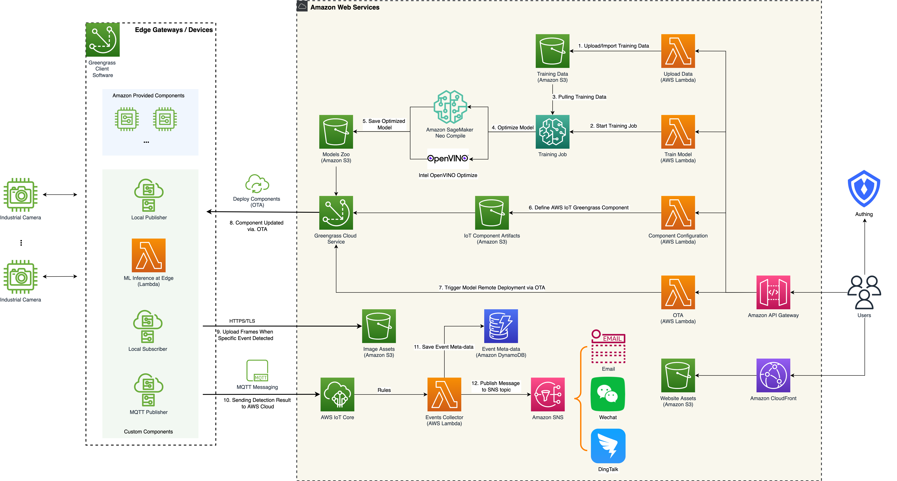

## 视觉分析之图像分类：云端训练与端侧推理

*Solutions Architect: 徐高伟 (gaowexu@amazon.com)*

#### 参考架构



#### 步骤一：基于SageMaker Notebook与PyTorch构建图像分类模型

基于亚马逊云科技云端SageMaker Notebook，用户可以方便的构建自定义图像数据上的分类任务，示例代码
(参考[custom_image_classification.ipynb](./image_classification/custom_image_classification.ipynb))中演示了
如何基于PyTorch构建自定义数据集，构建自定义图像分类模型，定义训练脚本，前向推理脚本，以及模型的保存，加载等深度学习全生命
周期的各个环节。同时最后将保存的模型基于SageMaker Neo进行编译优化（示例中目标运行设备为jetson_nano），进一步提升该模型的推理
运行速度。

SageMaker Neo优化之后的模型目录为：
```angular2html
.
├── compiled.meta
├── compiled_model.json
├── compiled.params
├── compiled.so
├── dlr.h
├── libdlr.so
└── manifest
```


#### 步骤二：NVIDIA Jetson NANO平台运行测试
由于SageMaker Neo目前仅支持NVIDIA JetPack 4.3/4.4/4.5版本，在下载Jetson Nano镜像时候
注意选择合适的版本（最新版为JetPack 4.6,不兼容），建议选择JetPack 4.5标准4GB版本。

> 参考：
> - https://developer.nvidia.com/embedded/downloads#?search=JetPack%204.5
> - https://github.com/neo-ai/neo-ai-dlr

在该教程中预先下载好JetPack 4.5装机镜像文件存放在S3桶后以防后续装机使用，路径为：
https://neo-models-zoo.s3.amazonaws.com/software/jetson-nano-jp45-sd-card-image.zip

如何装机参考官方指南：https://developer.nvidia.com/embedded/learn/get-started-jetson-nano-devkit#write

装机成功后登录进NVIDIA JETSON NANO开发板，执行如下命令：
```angular2html
sudo apt-get update
sudo apt-get install -y python3-pip cython
pip3 install --upgrade pip
wget -c https://neo-models-zoo.s3.amazonaws.com/software/dlr-1.10.0-py3-none-any.whl
pip3 install dlr-1.10.0-py3-none-any.whl
wget -c https://neo-models-zoo.s3.amazonaws.com/output/jetson_nano/classification/scenes-jetson_nano.tar.gz
mkdir clsmodel
tar -zxvf scenes-jetson_nano.tar.gz -C clsmodel
```

最后执行如下命令测试推理:
```angular2html
python3 neo_classifier_demo.py
```


